# Windows 11 Enterprise Golden Template

## Document Control

| Field | Value |
|---|---|
| Document ID | GEIL-PLAT-W11-GOLD-001 |
| Owner | Infrastructure Engineering |
| Status | Approved |
| Version | 2.0 |
| Last Reviewed | 2026-07-01 |
| Review Cycle | Quarterly |
| Classification | Internal Confidential |

!!! note "Canonical GNTECH values"

    Forest: `corp.gntech.me`; NetBIOS: `GNTECH`; primary UPN suffix: `gntech.me`; Microsoft 365 primary domain: `gntech.me`; primary firewall: MikroTik CHR `HQ-FW01`; workstation client VLAN: VLAN 30.

!!! danger "Never domain-join a golden template"

    The Windows 11 golden template must remain workgroup-only. Do not join `corp.gntech.me`, do not Entra join, do not Intune enroll, and do not sign in with production user identities inside the template. Domain join happens only after cloning and after network validation in [Windows 11 Domain Join and GPO Validation](windows-11-domain-join-gpo-validation.md).

## Purpose

Create a reusable Windows 11 Enterprise golden template for Proxmox. This guide covers only the template image lifecycle: Windows installation, VirtIO drivers, QEMU Guest Agent, Cloudbase-Init, Cloud-Init metadata support, log validation, Sysprep, and Proxmox template conversion.

## Scope

Included:

- Install Windows 11 Enterprise.
- Install VirtIO storage/network/balloon drivers.
- Install QEMU Guest Agent.
- Install and configure Cloudbase-Init.
- Configure Cloud-Init metadata support for Proxmox clones.
- Validate Cloudbase-Init logs.
- Run Sysprep.
- Convert the VM to a Proxmox template.

Excluded:

- Domain join.
- Group Policy validation.
- Intune enrollment.
- Windows Hello for Business.
- Production user sign-in.

Those tasks happen only after cloning the template.

## Pilot finding

Pilot deployment confirmed that the template must remain workgroup-only. A template that is domain-joined or used interactively carries identity state into every clone and can create duplicate secure-channel, profile, policy, enrollment, and supportability problems.

GEIL therefore separates the model into two guides:

1. This guide builds the workgroup-only template.
2. [Windows 11 Domain Join and GPO Validation](windows-11-domain-join-gpo-validation.md) clones the template, validates VLAN30 networking and Active Directory reachability, joins `corp.gntech.me`, moves the computer object to the Workstations OU, and validates `GP - Baseline - Workstations`.

## Architecture Overview

```mermaid
flowchart LR
    ISO[Windows 11 Enterprise ISO] --> VM[Workgroup template VM]
    VM --> Drivers[VirtIO drivers]
    Drivers --> Agent[QEMU Guest Agent]
    Agent --> Cloudbase[Cloudbase-Init]
    Cloudbase --> Logs[Cloudbase-Init log validation]
    Logs --> Sysprep[Sysprep generalize]
    Sysprep --> Template[Proxmox template]
    Template --> Clone[Domain join happens only after clone]
```



## Prerequisites

- Proxmox VE 9 host `PVE-HQ01` is available.
- `GEILLAN` exists and is VLAN-aware.
- Windows 11 Enterprise ISO is available.
- VirtIO driver ISO is available.
- Cloudbase-Init Windows installer is available.
- Local template administrator password is stored in the approved password manager.
- No domain credentials are used during template build.

## Starting state

- Template VM does not exist, or an earlier failed template VM has been removed.
- No domain-joined Windows 11 template exists.
- No production user profile exists inside the image.

## Expected ending state

- `TPL-W11-ENT-GOLD` is a Proxmox template.
- The image is generalized with Sysprep.
- The template is workgroup-only.
- VirtIO drivers are installed.
- QEMU Guest Agent is installed and running before Sysprep.
- Cloudbase-Init is installed and configured for clone metadata.
- Cloudbase-Init logs show successful startup before Sysprep.

## Step-by-Step Procedure

### Step 1: Create the template VM

#### Goal

Create a clean Windows 11 Enterprise VM that will become the template.

#### Why this step matters

Template identity must be generic. Do not use the final workstation name and do not join the domain.

#### Commands

Run from `PVE-HQ01` and adjust only the VMID if already used:

```bash
qm create 9201 \
  --name TPL-W11-ENT-GOLD \
  --memory 8192 \
  --cores 4 \
  --cpu host \
  --machine q35 \
  --bios ovmf \
  --efidisk0 local-lvm:1,efitype=4m,pre-enrolled-keys=1 \
  --scsihw virtio-scsi-single \
  --net0 virtio,bridge=GEILLAN,tag=30 \
  --agent enabled=1 \
  --ostype win11
```

Attach the Windows 11 ISO and VirtIO ISO from the Proxmox GUI, then install Windows 11 Enterprise.

#### Validation

```bash
qm config 9201
```

Expected output includes `name: TPL-W11-ENT-GOLD`, `bridge=GEILLAN`, `tag=30`, and `agent: enabled=1`.

#### Rollback

```bash
qm stop 9201
qm destroy 9201 --purge
```

### Step 2: Install Windows 11 and VirtIO drivers

#### Goal

Install Windows 11 Enterprise and ensure all storage/network devices use supported VirtIO drivers.

#### Commands

Inside Windows, use Device Manager or the VirtIO ISO to install missing drivers. Then validate:

```powershell
Get-PnpDevice | Where-Object Status -ne "OK"
Get-NetAdapter | Select-Object Name,InterfaceDescription,Status,LinkSpeed
```

#### Expected output

No critical storage or network devices should appear with missing drivers.

#### Rollback

If network or storage drivers cannot be corrected, rebuild the template VM before continuing.

### Step 3: Install QEMU Guest Agent

#### Goal

Enable Proxmox guest integration for clean shutdown, IP reporting, and clone operations.

#### Commands

Install `qemu-ga-x86_64.msi` from the VirtIO ISO. Validate:

```powershell
Get-Service QEMU-GA | Select-Object Name,Status,StartType
```

Expected output: `QEMU-GA` is `Running` and startup type is automatic.

#### Rollback

Uninstall and reinstall the QEMU Guest Agent from the VirtIO ISO if the service is missing or stopped.

### Step 4: Install and configure Cloudbase-Init

#### Goal

Prepare the template to consume Proxmox Cloud-Init metadata after cloning.

#### Why this step matters

Cloudbase-Init lets each clone receive unique hostname, password, network, and initialization metadata without baking those values into the template.

#### Commands

Install Cloudbase-Init for Windows. Configure the metadata service to include ConfigDrive support.

Open the Cloudbase-Init configuration file as Administrator:

```powershell
notepad 'C:\Program Files\Cloudbase Solutions\Cloudbase-Init\conf\cloudbase-init.conf'
```

The configuration must include metadata services compatible with Proxmox Cloud-Init, for example:

```ini
metadata_services=cloudbaseinit.metadata.services.configdrive.ConfigDriveService
plugins=cloudbaseinit.plugins.common.mtu.MTUPlugin,cloudbaseinit.plugins.common.sethostname.SetHostNamePlugin,cloudbaseinit.plugins.windows.createuser.CreateUserPlugin,cloudbaseinit.plugins.common.setuserpassword.SetUserPasswordPlugin,cloudbaseinit.plugins.windows.extendvolumes.ExtendVolumesPlugin
allow_reboot=false
first_logon_behaviour=no
```

#### Validation

```powershell
Get-Service cloudbase-init | Select-Object Name,Status,StartType
Get-Content 'C:\Program Files\Cloudbase Solutions\Cloudbase-Init\log\cloudbase-init.log' -Tail 60
```

Expected result: service exists, starts without fatal errors, and logs are readable.

#### Rollback

If Cloudbase-Init logs show fatal metadata or plugin failures before Sysprep, uninstall/reinstall Cloudbase-Init and validate again before continuing.

### Step 5: Validate template remains workgroup-only

#### Goal

Prove the image contains no domain, Entra, or Intune identity state.

#### Commands

```powershell
(Get-CimInstance Win32_ComputerSystem) | Select-Object Name,Domain,PartOfDomain,Workgroup
dsregcmd /status
```

Expected result:

- `PartOfDomain` is `False`.
- Workgroup is present.
- Device is not Entra joined.
- Device is not Intune enrolled.

#### Stop condition

STOP if the template is domain joined, Entra joined, Intune enrolled, or contains production user profiles. Rebuild the template.

### Step 6: Snapshot before Sysprep

#### Goal

Create a recovery checkpoint before generalization.

#### Commands

```bash
qm snapshot 9201 CP-TPL-W11-PRE-SYSPREP --description "Windows 11 Enterprise template before sysprep"
```

#### Validation

```bash
qm listsnapshot 9201
```

#### Rollback

```bash
qm rollback 9201 CP-TPL-W11-PRE-SYSPREP
```

### Step 7: Run Sysprep

#### Goal

Generalize the image so each clone receives a unique identity.

#### Commands

Run inside Windows as Administrator:

```powershell
C:\Windows\System32\Sysprep\Sysprep.exe /generalize /oobe /shutdown
```

#### Expected output

The VM shuts down after Sysprep completes.

#### Stop condition

STOP if Sysprep fails. Do not convert an unsysprepped image to template.

### Step 8: Convert to Proxmox template

#### Goal

Convert the shutdown generalized VM into a reusable Proxmox template.

#### Commands

```bash
qm template 9201
```

#### Validation

```bash
qm config 9201
```

Expected result: the VM is marked as a template in Proxmox and is no longer started directly.

#### Rollback

If conversion was premature, clone the pre-sysprep snapshot or rebuild from the documented template process. Do not manually reverse production template state after clones exist.

## Deployment Validation

Clone one disposable validation VM and confirm it boots uniquely without joining a domain.

```powershell
hostname
(Get-CimInstance Win32_ComputerSystem) | Select-Object Name,Domain,PartOfDomain,Workgroup
Get-NetAdapter | Select-Object Name,Status,LinkSpeed
Get-Service QEMU-GA,cloudbase-init | Select-Object Name,Status,StartType
Get-Content 'C:\Program Files\Cloudbase Solutions\Cloudbase-Init\log\cloudbase-init.log' -Tail 60
```

Expected result: clone boots, has working VirtIO networking, runs QEMU Guest Agent, has Cloudbase-Init available, and is not domain joined.

## Evidence Collection

Capture:

- Proxmox VM hardware page.
- VM config output.
- Device Manager or `Get-PnpDevice` output.
- QEMU Guest Agent service status.
- Cloudbase-Init service status and log tail.
- Workgroup-only validation output.
- Sysprep command evidence.
- Template conversion evidence.
- Disposable clone validation output.

## Troubleshooting

| Symptom | Cause | Fix |
|---|---|---|
| Template is domain joined | Domain join happened before cloning | Rebuild. Do not reuse a domain-joined template. |
| Clone has duplicate identity | Sysprep skipped or failed | Revert to pre-sysprep snapshot and rerun Sysprep. |
| Network missing | VirtIO driver absent | Install VirtIO drivers before Sysprep. |
| QEMU guest info missing | QEMU Guest Agent not installed/running | Reinstall guest agent and validate service. |
| Cloudbase-Init errors | Metadata service or plugin configuration wrong | Fix config and logs before Sysprep. |
| Intune enrollment conflict | Template was enrolled | Rebuild; never enroll the template. |

## Next Guide

Continue to [Windows 11 Domain Join and GPO Validation](windows-11-domain-join-gpo-validation.md) after the template is converted and validated.

## Deployment Verified

| Field | Value |
|---|---|
| Validated on | Pilot finding validated the model: templates must remain workgroup-only and domain join happens only after cloning and network validation. |
| Windows Server version | Not applicable |
| RouterOS version | Not applicable unless validating VLAN30 reachability after clone |
| Proxmox version | Proxmox VE 9 target |
| Deployment date | 2026-07-01 pilot lesson incorporated |
| Deployment notes | The template guide now excludes domain join and identity enrollment by design. |
| Known caveats | Validate exact Cloudbase-Init version and plugins during the next template build. |
