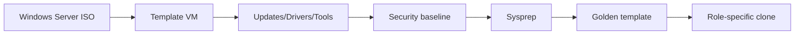

# Windows Server 2025 Golden Template

## Document Control

| Field | Value |
|---|---|
| Document ID | GEIL-PLAT-WS2025-GOLD-001 |
| Owner | Infrastructure Engineering |
| Status | Draft |
| Version | 1.0 |
| Last Reviewed | 2026-06-30 |
| Review Cycle | Quarterly |
| Classification | Internal Confidential |

!!! note "Canonical GNTECH values"

    Forest: `corp.gntech.me`; NetBIOS: `GNTECH`; primary UPN suffix: `gntech.me`; Microsoft 365 primary domain: `gntech.me`; hybrid identity plane: Microsoft Entra ID; primary firewall: MikroTik CHR `HQ-FW01`.


## Purpose

Create a Windows Server 2025 golden template for Proxmox so future servers can be deployed consistently before joining `corp.gntech.me`.

## Architecture Overview



## Enterprise rationale

A golden template reduces drift. It does not contain domain membership, production secrets, static role configuration, or service-specific credentials.

## Build steps

### Step 1: Create template VM

Use Proxmox on `PVE-HQ01`. Attach the Windows Server 2025 ISO and VirtIO drivers. Use a generic template VM name such as `TPL-WS2025-GOLD`.

### Step 2: Install updates, drivers, and VM tools

Install Windows updates, VirtIO drivers, QEMU guest agent, and time synchronization settings.

```powershell
Get-WindowsUpdateLog
Get-Service QEMU-GA -ErrorAction SilentlyContinue
Get-PnpDevice | Where-Object Status -ne "OK"
```

### Step 3: Apply baseline security

Apply local security settings that are safe before domain join. Do not apply domain-specific GPO settings inside the image.

```powershell
Get-ComputerInfo | Select-Object WindowsProductName,OsHardwareAbstractionLayer
Get-MpComputerStatus | Select-Object AMServiceEnabled,AntivirusEnabled,RealTimeProtectionEnabled
```

### Step 4: Snapshot before Sysprep

```bash
qm snapshot <VMID> CP-TPL-WS2025-PRE-SYSPREP --description "Windows Server 2025 template before sysprep"
```

### Step 5: Sysprep

```powershell
C:\Windows\System32\Sysprep\Sysprep.exe /generalize /oobe /shutdown
```

### Step 6: Convert to template

```bash
qm template <VMID>
```

## Validation

Clone a test VM, boot it, set hostname such as `TEST-WS2025-001`, and validate:

```powershell
hostname
Get-ComputerInfo | Select-Object WindowsProductName
Get-Service QEMU-GA
Get-NetAdapter
```

Expected result: clone boots uniquely, no production domain membership exists, VM tools run, and drivers are healthy.

## Stop conditions

STOP if the image contains secrets, static IPs, domain membership, role-specific certificates, or product credentials.

## Rollback

If Sysprep fails, revert to `CP-TPL-WS2025-PRE-SYSPREP`, fix the issue, and rerun Sysprep. Do not deploy clones from an unsysprepped template.

## Screenshot placeholders

Capture screenshots during real deployment:

- Proxmox VM hardware page.
- Windows Update history.
- Device Manager showing no missing drivers.
- Sysprep shutdown state.
- Proxmox template icon.

## Evidence Collection

Capture VM config, update status, driver status, guest agent status, Sysprep command, template conversion command, and test-clone validation.

## Troubleshooting

| Symptom | Cause | Fix |
|---|---|---|
| Clone has duplicate identity | Sysprep skipped | Rebuild from pre-sysprep snapshot. |
| No network | VirtIO driver missing | Install correct driver before Sysprep. |
| Guest agent missing | QEMU agent not installed/enabled | Install and enable before template conversion. |

## Next Guide

Use this template before [Windows Server 2025 Baseline](../microsoft-core/windows-server-2025-baseline.md).
