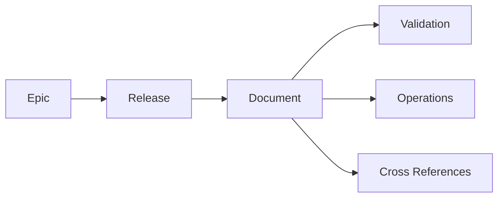
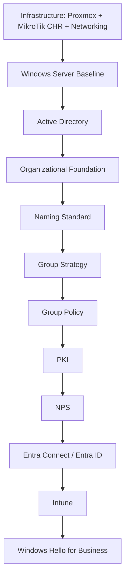

# Documentation Roadmap

## Document Control

| Field | Value |
|---|---|
| Document ID | GEIL-PRJ-ROADMAP-001 |
| Owner | Infrastructure Engineering |
| Status | Draft |
| Version | 19.0 |
| Last Reviewed | 2026-06-29 |
| Review Cycle | Quarterly |
| Classification | Internal Confidential |

## Purpose

The roadmap organizes GEIL by enterprise capability Epics, Releases, and Documents. It intentionally avoids technology-first sequencing so the library can scale beyond 1,000 pages without restructuring.

## Roadmap model

Rules:

1. Every Release belongs to exactly one Epic.
2. Every Document belongs to exactly one Release.
3. Dependencies are shown in [Epic and Release Architecture](epic-release-architecture.md).
4. New documents are not considered published until the release assignment register is updated.

## Canonical architecture checkpoint

The current canonical model after ADR-0002 and ADR-0003 is: firewall `HQ-FW01` runs MikroTik CHR / RouterOS; forest and server FQDNs use `corp.gntech.me`; NetBIOS is `GNTECH`; primary user UPN suffix is `gntech.me`; users sign in as `username@gntech.me`; legacy logon remains `GNTECH\username`. OPNsense and old identity examples may appear only in historical or explicitly superseded explanations.

## Production readiness checkpoint

GEIL implementation-phase documentation must pass engineering validation as well as MkDocs validation. The current repository-wide checkpoint is recorded in [Production Readiness Audit Report](production-readiness-audit-report.md). Future implementation guide changes must treat field deployment issues as engineering bugs, correct all affected documents, and avoid committing LOW-confidence deployment logic.

## Capability-first roadmap

| Epic | Release | Capability | Status | Evidence / Primary Documents |
|---|---|---|---|---|
| E00 Documentation Governance and Publishing | E00.R01 | Governance foundation | Done | [Project Charter](project-charter.md), [Environment Specification](environment-specification.md), [Document Index](document-index.md), [Documentation Backlog](documentation-backlog.md), [Epic and Release Architecture](epic-release-architecture.md), [Production Readiness Audit Report](production-readiness-audit-report.md) |
| E00 Documentation Governance and Publishing | E00.R01 | Visual documentation standard | Done | [Visual Documentation Standard](../governance/visual-documentation-standard.md) |
| E00 Documentation Governance and Publishing | E00.R01 | Implementation guide standard | Done | [Implementation Guide Standard](../governance/implementation-guide-standard.md) |
| E00 Documentation Governance and Publishing | E00.R01 | Educational documentation standard | Done | [Educational Documentation Standard](../governance/educational-documentation-standard.md) |
| E00 Documentation Governance and Publishing | E00.R02 | Publishing platform | Done | [Cloudflare Pages Deployment Runbook](../platform/cloudflare-pages-deployment.md) |
| E01 Enterprise Architecture | E01.R01 | Reference architecture | Done | [Reference Architecture](../architecture/reference-architecture.md), [Identity Architecture](../architecture/identity-architecture.md), [Network Architecture](../architecture/network-architecture.md) |
| E01 Enterprise Architecture | E01.R02 | Enterprise Architecture Vision | Done | [GEIL Master Plan](master-plan.md), [Enterprise Capability Model](../architecture/enterprise-capability-model.md), [Enterprise Reference Architecture](../architecture/enterprise-reference-architecture.md), [Technology Selection Matrix](../architecture/technology-selection-matrix.md), [Implementation Philosophy](../architecture/implementation-philosophy.md), [Architecture Principles](../architecture/architecture-principles.md) |
| E02 Enterprise Foundation | E02.R01 | HQ site foundation | Done | [Phase 0 Prerequisites](../foundation/phase-0-prerequisites.md), [Proxmox VE Baseline](../foundation/proxmox-ve-baseline.md), [Superseded OPNsense Edge Firewall](../foundation/opnsense-edge-firewall.md) |
| E02 Enterprise Foundation | E02.R02 | Enterprise Lab Blueprint | Done | [Enterprise Lab Blueprint HLD](../architecture/enterprise-lab-blueprint.md), [Enterprise Lab Network HLD](../architecture/enterprise-lab-network-hld.md), [Enterprise Lab Identity HLD](../architecture/enterprise-lab-identity-hld.md), [Enterprise Lab Operations HLD](../architecture/enterprise-lab-operations-hld.md) |
| E02 Enterprise Foundation | E02.R03 | HQ Foundation Low-Level Design and Build Plan | Done | [Proxmox HQ Foundation LLD](../platform/proxmox-hq-foundation-lld.md), [MikroTik CHR HQ Foundation LLD](../platform/mikrotik-chr-hq-foundation-lld.md), [Phase 1 Build Plan](../platform/phase-1-build-plan.md), [Phase 1 Validation Plan](../platform/phase-1-validation-plan.md), [Firewall Rule Matrix](../platform/firewall-rule-matrix.md), [Active Directory Network Requirements](../platform/active-directory-network-requirements.md), [Enterprise Port Reference](../platform/enterprise-port-reference.md) |
| E02 Enterprise Foundation | E02.R04 | HQ Foundation Implementation Runbook | Done | [Proxmox HQ Foundation Implementation](../platform/proxmox-hq-foundation-implementation.md), [MikroTik CHR HQ Foundation Implementation](../platform/mikrotik-chr-hq-foundation-implementation.md), [Windows Server 2025 Golden Template](../platform/windows-server-2025-golden-template.md), [Windows 11 Enterprise Golden Template](../platform/windows-11-enterprise-golden-template.md), [Windows 11 Management Workstation](../platform/windows-11-management-workstation.md), [Windows 11 Domain Join and GPO Validation](../platform/windows-11-domain-join-gpo-validation.md), [ADR-0002](../governance/adrs/ADR-0002-mikrotik-chr-phase-1-firewall.md) |
| E02 Enterprise Foundation | E02.R04 | Implementation Detail Upgrade | Done | Operator-grade detail added to Proxmox, MikroTik CHR, build, validation, and acceptance documents; expanded operator walkthroughs added for MikroTik CHR and Windows Server deployment |
| E02 Enterprise Foundation | E02.R05 | HQ Foundation Evidence and Acceptance Package | Done | [Phase 1 Acceptance Package](../platform/phase-1-acceptance-package.md) |
| E03 Identity, Trust, and Access | E03.R01 | Core directory services | Done | [Windows Server 2025 Baseline](../microsoft-core/windows-server-2025-baseline.md), [Active Directory Implementation](../microsoft-core/active-directory-implementation.md), [Active Directory Organizational Foundation](../microsoft-core/active-directory-organizational-foundation.md), [Enterprise Naming Standard](../microsoft-core/active-directory-naming-standard.md), [Enterprise Group Strategy](../microsoft-core/group-strategy.md), [Enterprise User Lifecycle](../microsoft-core/user-lifecycle.md), [Enterprise Service Account Standard](../microsoft-core/service-account-standard.md), [DNS and DHCP Implementation](../microsoft-core/dns-dhcp-implementation.md), [Group Policy Baseline](../microsoft-core/group-policy-baseline.md) |
| E03 Identity, Trust, and Access | E03.R02 | Trust and network authentication | Done | [AD CS PKI](../microsoft-core/ad-cs-pki.md), [NPS RADIUS 802.1X](../microsoft-core/nps-radius-8021x.md) |
| E03 Identity, Trust, and Access | E03.R03 | Privileged access control plane | Done | [Privileged Access Model](../security/privileged-access-model.md), [Enterprise Administrative Tiering](../security/administrative-tiering.md) |
| E04 Cloud and Endpoint Management | E04.R01 | Cloud identity and endpoint management | Done | [Microsoft 365 Tenant Foundation](../cloud-endpoint/microsoft-365-tenant-foundation.md), [Entra ID Hybrid Identity](../cloud-endpoint/entra-id-hybrid-identity.md), [Intune Windows 11 Enterprise](../cloud-endpoint/intune-windows11-enterprise.md), [Windows Hello for Business](../cloud-endpoint/windows-hello-for-business.md), [Microsoft Defender](../cloud-endpoint/microsoft-defender.md) |
| E05 Operations and Resilience | E05.R01 | Operations readiness | Done | [Monitoring and Alerting](../operations/monitoring-alerting.md), [Backup and Recovery](../operations/backup-recovery.md), [Domain Controller Backup and Recovery](../operations/domain-controller-backup.md), [Troubleshooting](../operations/troubleshooting.md), [Scaling Model](../operations/scaling-model.md), [Security Operations](../operations/security-operations.md) |
| E03 Identity, Trust, and Access | E03.R04 | Certificate lifecycle management | Open | DOC-003 |
| E04 Cloud and Endpoint Management | E04.R02 | Conditional Access and device compliance | Open | DOC-004 |
| E03 Identity, Trust, and Access | E03.R05 | Privileged access operations | Open | DOC-007, DOC-008, DOC-009 |
| E03 Identity, Trust, and Access | E03.R06 | Service account lifecycle | Open | DOC-010 |
| E00 Documentation Governance and Publishing | E00.R03 | Repository security and branch protection | Open | Future repository security runbook |
| E00 Documentation Governance and Publishing | E00.R04 | Documentation quality and visual asset migration | In Progress | Visual asset migration completed for priority complex diagrams; glossary, templates, and CI quality gates remain open |
| E07 Scale and Expansion | E07.R01 | Multinational data residency | Open | DOC-005 |
| E05 Operations and Resilience | E05.R02 | Monitoring deep dives | Open | AD, certificate, and Microsoft 365 monitoring runbooks |
| E06 Security Assurance and Compliance | E06.R01 | Security assurance evidence | Open | Control mapping and exception governance |
| E07 Scale and Expansion | E07.R02 | Regional operations model | Open | Multi-site delegated operations |

## Enterprise Identity Foundation dependency graph

## Release exit criteria

A release is Done only when:

1. Every required document is linked in navigation.
2. Every document appears in the document index.
3. Every document appears exactly once in the release assignment register.
4. Required diagrams and dependency links are present.
5. Backlog status is updated.
6. `mkdocs build --strict` succeeds.

## Next recommended release

The next recommended guide is **Group Policy Baseline** after Active Directory Organizational Foundation validation. The next recommended new release remains **E03.R04 Certificate lifecycle management**, delivered by backlog item `DOC-003`. All E03.R04 documents must reference the Enterprise Lab Blueprint HLD and the E02.R03/E02.R04/E02.R05 HQ Foundation design, implementation, and acceptance baseline before defining implementation details.

## Documentation Quality Initiative

The primary roadmap objective is now improving existing deployment guides to Microsoft Learn / VMware / Cisco / Red Hat / HashiCorp quality before creating new implementation documents. The first DQI report is [Documentation Quality Report](documentation-quality-report.md).

- **Completed:** Code Block Quality Standard and audit tools added after Pilot Deployment 001 exposed copy/paste command defects.
