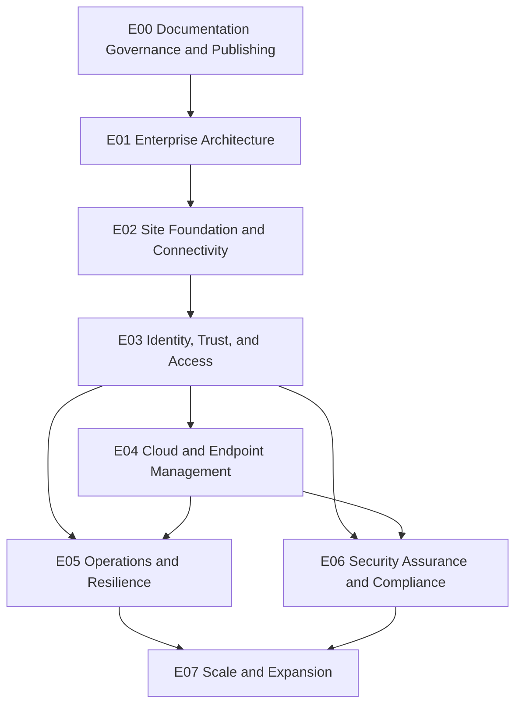
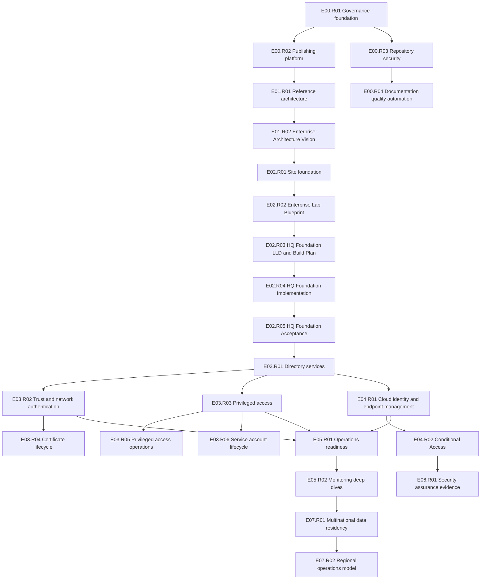
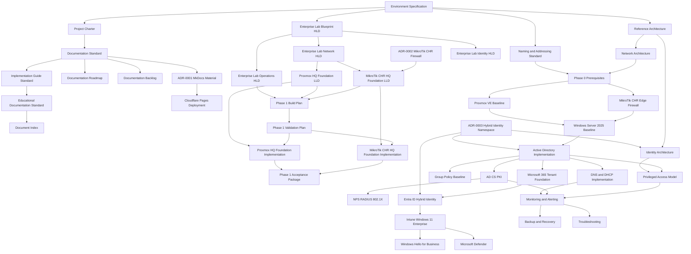

# Epic and Release Architecture

## Document Control

| Field | Value |
|---|---|
| Document ID | GEIL-PRJ-ERA-001 |
| Owner | Infrastructure Engineering |
| Status | Approved |
| Version | 7.0 |
| Last Reviewed | 2026-06-29 |
| Review Cycle | Quarterly |
| Classification | Internal Confidential |

## Purpose

This document defines the capability-first documentation architecture for GEIL. It replaces technology-first sequencing with a durable model of Epics, Releases, and Documents that can scale beyond 1,000 pages without structural reorganization.

GEIL still preserves technology-specific implementation documents, but those documents are governed by enterprise capabilities rather than by product silos.

## Architecture rules

1. Every document belongs to exactly one Release.
2. Every Release belongs to exactly one Epic.
3. Epics describe enterprise capabilities, not vendor products.
4. Releases describe deliverable increments of a capability.
5. Documents describe implementation, operation, validation, rollback, or governance artifacts inside a Release.
6. A document may cross-reference many documents, but it has only one release owner.
7. Dependencies flow between capabilities and documents; ownership remains singular.
8. New documents must be added to the release assignment register before publication.

!!! note "Adaptation"

    This architecture is organized around GNTECH capabilities and the canonical environment in [Environment Specification](environment-specification.md). Organizations adapting this design should keep the Epic/Release/Document model, but may rename capabilities to match their operating model.

## Capability Epics

| Epic | Capability | Purpose |
|---|---|---|
| E00 | Documentation Governance and Publishing | Controls the documentation operating model, canonical environment data, publishing workflow, document lifecycle, ADRs, roadmap, backlog, and index. |
| E01 | Enterprise Architecture | Defines target-state capabilities, environment tiers, identity boundaries, and network architecture before implementation work begins. |
| E02 | Site Foundation and Connectivity | Establishes the HQ infrastructure substrate: prerequisites, naming/addressing, virtualization, firewalling, VLANs, and edge connectivity. |
| E03 | Identity, Trust, and Access | Builds the AD DS, DNS, DHCP, GPO, PKI, RADIUS, PowerShell, and privileged access capabilities that other systems depend on. |
| E04 | Cloud and Endpoint Management | Establishes Microsoft 365, Entra ID, Intune, Windows 11 Enterprise, Windows Hello for Business, and Defender capabilities. |
| E05 | Operations and Resilience | Defines monitoring, backup, troubleshooting, security operations, management access, scaling, and recovery capabilities. |
| E06 | Security Assurance and Compliance | Future epic for formal security baselines, audit evidence, compliance control mapping, and exception governance. |
| E07 | Scale and Expansion | Future epic for multi-site, multinational, data residency, regional services, and delegated operations models. |

## Capability dependency graph

## Release dependency graph

## Document dependency graph

## Release assignment register

The following register assigns every current published document to exactly one release.

| Release | Epic | Document |
|---|---|---|
| E00.R01 - Documentation governance foundation | E00 | `index.md` |
| E00.R01 - Documentation governance foundation | E00 | `project/index.md` |
| E00.R01 - Documentation governance foundation | E00 | `project/project-charter.md` |
| E00.R01 - Documentation governance foundation | E00 | `project/environment-specification.md` |
| E00.R01 - Documentation governance foundation | E00 | `project/document-index.md` |
| E00.R01 - Documentation governance foundation | E00 | `project/documentation-backlog.md` |
| E00.R01 - Documentation governance foundation | E00 | `project/documentation-roadmap.md` |
| E00.R01 - Documentation governance foundation | E00 | `project/implementation-guide-audit-report.md` |
| E00.R01 - Documentation governance foundation | E00 | `project/documentation-quality-report.md` |
| E00.R01 - Documentation governance foundation | E00 | `project/epic-release-architecture.md` |
| E00.R01 - Documentation governance foundation | E00 | `governance/index.md` |
| E00.R01 - Documentation governance foundation | E00 | `governance/documentation-standard.md` |
| E00.R01 - Documentation governance foundation | E00 | `governance/visual-documentation-standard.md` |
| E00.R01 - Documentation governance foundation | E00 | `governance/implementation-guide-standard.md` |
| E00.R01 - Documentation governance foundation | E00 | `governance/educational-documentation-standard.md` |
| E00.R01 - Documentation governance foundation | E00 | `governance/deployment-style-guide.md` |
| E00.R01 - Documentation governance foundation | E00 | `governance/backlog.md` |
| E00.R01 - Documentation governance foundation | E00 | `governance/roadmap.md` |
| E00.R01 - Documentation governance foundation | E00 | `governance/adrs/index.md` |
| E00.R01 - Documentation governance foundation | E00 | `governance/adrs/ADR-0001-mkdocs-material.md` |
| E00.R01 - Documentation governance foundation | E00 | `governance/adrs/ADR-0002-mikrotik-chr-phase-1-firewall.md` |
| E00.R01 - Documentation governance foundation | E00 | `governance/adrs/ADR-0003-hybrid-identity-namespace.md` |
| E00.R02 - Documentation delivery platform | E00 | `platform/index.md` |
| E00.R02 - Documentation delivery platform | E00 | `platform/cloudflare-pages-deployment.md` |
| E01.R01 - Enterprise reference architecture | E01 | `architecture/index.md` |
| E01.R01 - Enterprise reference architecture | E01 | `architecture/reference-architecture.md` |
| E01.R01 - Enterprise reference architecture | E01 | `architecture/environment-tiers.md` |
| E01.R01 - Enterprise reference architecture | E01 | `architecture/identity-architecture.md` |
| E01.R01 - Enterprise reference architecture | E01 | `architecture/network-architecture.md` |
| E01.R02 - Enterprise Architecture Vision | E01 | `project/master-plan.md` |
| E01.R02 - Enterprise Architecture Vision | E01 | `architecture/enterprise-capability-model.md` |
| E01.R02 - Enterprise Architecture Vision | E01 | `architecture/enterprise-reference-architecture.md` |
| E01.R02 - Enterprise Architecture Vision | E01 | `architecture/technology-selection-matrix.md` |
| E01.R02 - Enterprise Architecture Vision | E01 | `architecture/implementation-philosophy.md` |
| E01.R02 - Enterprise Architecture Vision | E01 | `architecture/architecture-principles.md` |
| E02.R01 - Site foundation and edge platform | E02 | `foundation/index.md` |
| E02.R01 - Site foundation and edge platform | E02 | `foundation/phase-0-prerequisites.md` |
| E02.R01 - Site foundation and edge platform | E02 | `foundation/proxmox-ve-baseline.md` |
| E02.R01 - Site foundation and edge platform | E02 | `foundation/opnsense-edge-firewall.md` |
| E02.R01 - Site foundation and edge platform | E02 | `governance/naming-addressing-standard.md` |
| E02.R02 - Enterprise Lab Blueprint | E02 | `architecture/enterprise-lab-blueprint.md` |
| E02.R02 - Enterprise Lab Blueprint | E02 | `architecture/enterprise-lab-network-hld.md` |
| E02.R02 - Enterprise Lab Blueprint | E02 | `architecture/enterprise-lab-identity-hld.md` |
| E02.R02 - Enterprise Lab Blueprint | E02 | `architecture/enterprise-lab-operations-hld.md` |
| E02.R03 - HQ Foundation Low-Level Design and Build Plan | E02 | `platform/proxmox-hq-foundation-lld.md` |
| E02.R03 - HQ Foundation Low-Level Design and Build Plan | E02 | `platform/mikrotik-chr-hq-foundation-lld.md` |
| E02.R03 - HQ Foundation Low-Level Design and Build Plan | E02 | `platform/opnsense-hq-foundation-lld.md` |
| E02.R03 - HQ Foundation Low-Level Design and Build Plan | E02 | `platform/phase-1-build-plan.md` |
| E02.R03 - HQ Foundation Low-Level Design and Build Plan | E02 | `platform/phase-1-validation-plan.md` |
| E02.R04 - HQ Foundation Implementation Runbook | E02 | `platform/proxmox-hq-foundation-implementation.md` |
| E02.R04 - HQ Foundation Implementation Runbook | E02 | `platform/mikrotik-chr-hq-foundation-implementation.md` |
| E02.R04 - HQ Foundation Implementation Runbook | E02 | `platform/opnsense-hq-foundation-implementation.md` |
| E02.R05 - HQ Foundation Evidence and Acceptance Package | E02 | `platform/phase-1-acceptance-package.md` |
| E03.R01 - Core directory services | E03 | `microsoft-core/index.md` |
| E03.R01 - Core directory services | E03 | `microsoft-core/windows-server-2025-baseline.md` |
| E03.R01 - Core directory services | E03 | `microsoft-core/active-directory-implementation.md` |
| E03.R01 - Core directory services | E03 | `microsoft-core/dns-dhcp-implementation.md` |
| E03.R01 - Core directory services | E03 | `microsoft-core/group-policy-baseline.md` |
| E03.R01 - Core directory services | E03 | `microsoft-core/powershell-operations.md` |
| E03.R02 - Trust and network authentication | E03 | `microsoft-core/ad-cs-pki.md` |
| E03.R02 - Trust and network authentication | E03 | `microsoft-core/nps-radius-8021x.md` |
| E03.R03 - Privileged access control plane | E03 | `security/index.md` |
| E03.R03 - Privileged access control plane | E03 | `security/privileged-access-model.md` |
| E04.R01 - Cloud identity and endpoint management | E04 | `cloud-endpoint/index.md` |
| E04.R01 - Cloud identity and endpoint management | E04 | `cloud-endpoint/microsoft-365-tenant-foundation.md` |
| E04.R01 - Cloud identity and endpoint management | E04 | `cloud-endpoint/entra-id-hybrid-identity.md` |
| E04.R01 - Cloud identity and endpoint management | E04 | `cloud-endpoint/intune-windows11-enterprise.md` |
| E04.R01 - Cloud identity and endpoint management | E04 | `cloud-endpoint/windows-hello-for-business.md` |
| E04.R01 - Cloud identity and endpoint management | E04 | `cloud-endpoint/microsoft-defender.md` |
| E05.R01 - Operations readiness | E05 | `operations/index.md` |
| E05.R01 - Operations readiness | E05 | `operations/monitoring-alerting.md` |
| E05.R01 - Operations readiness | E05 | `operations/backup-recovery.md` |
| E05.R01 - Operations readiness | E05 | `operations/troubleshooting.md` |
| E05.R01 - Operations readiness | E05 | `operations/scaling-model.md` |
| E05.R01 - Operations readiness | E05 | `operations/security-operations.md` |
| E05.R01 - Operations readiness | E05 | `microsoft-core/windows-admin-center.md` |

## Future release slots

| Release | Epic | Planned Capability | Primary Backlog Items |
|---|---|---|---|
| E02.R02 | E02 | Enterprise Lab Blueprint | Done |
| E02.R03 | E02 | HQ Foundation Low-Level Design and Build Plan | Done |
| E02.R04 | E02 | HQ Foundation Implementation Runbook | Done |
| E02.R05 | E02 | HQ Foundation Evidence and Acceptance Package | Done |
| E03.R04 | E03 | Certificate lifecycle management | DOC-003 |
| E04.R02 | E04 | Conditional Access and device compliance | DOC-004 |
| E03.R05 | E03 | Privileged access operations | DOC-007, DOC-008, DOC-009 |
| E03.R06 | E03 | Service account lifecycle | DOC-010 |
| E00.R03 | E00 | Repository security and branch protection | Future repository security runbook |
| E00.R04 | E00 | Documentation quality and visual asset migration | DOC-014 open; DOC-019 done |
| E07.R01 | E07 | Multinational data residency | DOC-005 |
| E05.R02 | E05 | Monitoring and alerting deep dives | AD, certificate, Microsoft 365 monitoring runbooks |
| E06.R01 | E06 | Security assurance evidence | Control mapping, exception register, audit evidence |
| E07.R02 | E07 | Regional operations model | Multi-site delegated operations |

## Change control

When adding a document:

1. Select the Epic that owns the enterprise capability.
2. Select or create exactly one Release under that Epic.
3. Add the document to the release assignment register.
4. Update the roadmap, backlog, document index, and navigation.
5. Run `mkdocs build --strict`.
