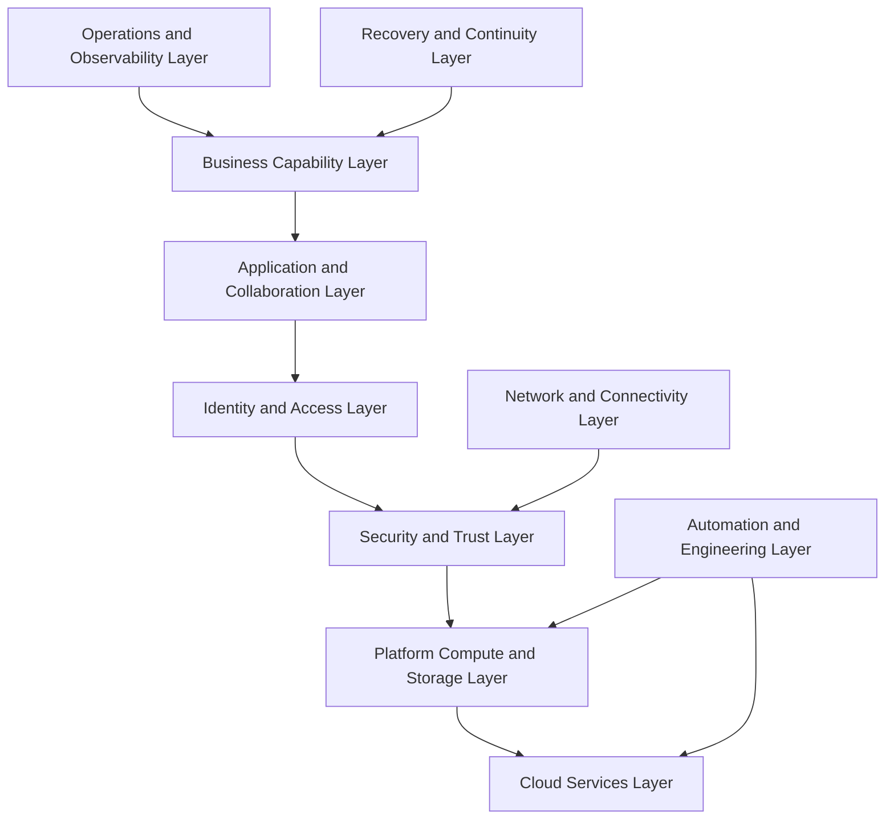

# GEIL Master Plan

## Document Control

| Field | Value |
|---|---|
| Document ID | GEIL-PRJ-MASTER-001 |
| Owner | Infrastructure Engineering |
| Status | Approved |
| Version | 1.0 |
| Last Reviewed | 2026-06-29 |
| Review Cycle | Quarterly |
| Classification | Internal Confidential |

## Vision

GEIL is the GNTECH Enterprise Infrastructure Engineering Library: the authoritative architecture, design, implementation, and operating system for GNTECH infrastructure.

GEIL exists to make infrastructure reproducible, secure, observable, recoverable, and scalable from the current HQ environment to a multinational enterprise. It is designed around enduring enterprise capabilities rather than current products. Products may change; capabilities remain.

## Mission

Build a complete enterprise infrastructure library that enables GNTECH to design, implement, operate, secure, monitor, troubleshoot, recover, and scale its infrastructure with engineering discipline.

GEIL must support the real GNTECH environment defined in [Environment Specification](environment-specification.md), including `corp.gntech.me`, `gntech.me`, `docs.gntechlabs.me`, `HQ`, `HQ-DC01`, `HQ-FW01`, `PVE-HQ01`, and the `172.20.0.0/16` network baseline.

## Guiding principles

- Capabilities are permanent; technologies are replaceable implementations.
- Documentation is a production control, not an afterthought.
- Architecture decisions precede implementation runbooks.
- Security, observability, recoverability, and operability are first-class architecture requirements.
- Every document must support one or more enterprise capabilities.
- Every implementation must be validated, reversible, and supportable.
- The library must scale beyond 1,000 pages without structural redesign.

## Long-term goals

| Goal | Target Outcome |
|---|---|
| Capability-aligned library | Every document maps to an enterprise capability, Epic, Release, and dependency path. |
| Reproducible infrastructure | GNTECH can rebuild core services from documentation and source-controlled artifacts. |
| Secure administration | Privileged access, identity, device trust, and monitoring are engineered as a system. |
| Cloud-integrated enterprise | Microsoft 365, Entra ID, Intune, Defender, and on-premises services operate as one architecture. |
| Multisite readiness | The architecture supports additional sites, regional datacenters, delegated operations, and compliance boundaries. |
| Operational excellence | Monitoring, backup, recovery, troubleshooting, and change control are embedded in every capability. |

## Success criteria

GEIL is successful when:

1. A qualified GNTECH engineer can deploy or recover a capability using GEIL without tribal knowledge.
2. Every production implementation has architecture, implementation, validation, rollback, and operations coverage.
3. Architectural deviations are captured through ADRs.
4. Dependency graphs make implementation order clear.
5. The documentation site builds with `mkdocs build --strict` at every release.
6. Canonical environment values remain consistent across the library.
7. The library remains useful when an implementation technology is replaced.

## Scope

GEIL covers enterprise capabilities for:

- Identity and access.
- Networking and connectivity.
- Compute and virtualization.
- Storage and data protection.
- Endpoint management.
- Messaging and collaboration.
- PKI and trust services.
- Security operations.
- Monitoring and observability.
- Backup, disaster recovery, and business continuity.
- Automation and infrastructure as code where practical.
- Governance, compliance, and architecture decision management.

## Out of scope

- Publishing secrets, private keys, credentials, tenant secrets, or recovery codes.
- Vendor documentation duplication without GNTECH-specific design or implementation requirements.
- Unapproved production changes outside change control.
- Product-specific procedures that are not tied to an enterprise capability.

## Enterprise capability model

The permanent capability model is defined in [Enterprise Capability Model](../architecture/enterprise-capability-model.md). The model organizes GEIL into capability domains such as Enterprise Identity, Networking, Compute, Storage, Endpoint Management, Messaging, PKI, Security, Monitoring, Backup, Disaster Recovery, Automation, Governance, Compliance, and Collaboration.

## Multi-year roadmap


| Horizon | Architecture Outcome |
|---|---|
| Year 1 | Canonical HQ environment, identity foundation, network segmentation, governance, documentation publishing, baseline security. |
| Year 2 | PKI lifecycle, Conditional Access, privileged access operations, monitoring, backup, service account lifecycle. |
| Year 3 | Automation standards, infrastructure as code where practical, multisite architecture, repeatable site deployment. |
| Year 4 | Regional operations, compliance evidence, disaster recovery maturity, delegated administration. |
| Year 5 | Multinational operating model, regional resilience, platform engineering, formal control mapping. |

## Milestones

| Milestone | Completion Criteria |
|---|---|
| M1 Governance Baseline | Charter, environment specification, document index, backlog, roadmap, publishing workflow, and release architecture are complete. |
| M2 Architecture Foundation | Capability model, reference architecture, technology matrix, principles, and implementation philosophy are complete. |
| M3 HQ Core Infrastructure | Foundation, identity, DNS/DHCP, GPO, PKI, NPS, and privileged access baseline are implemented and validated. |
| M4 Cloud and Endpoint Control | Microsoft 365, Entra ID, Intune, Defender, WHfB, and Conditional Access are implemented and validated. |
| M5 Operations Readiness | Monitoring, backup, recovery, troubleshooting, security operations, and incident procedures are validated. |
| M6 Scale Readiness | Multisite, regional, international, and multinational architecture patterns are documented and tested. |

## Release strategy

GEIL uses capability releases, not product releases. A release delivers a coherent enterprise capability increment and may contain architecture documents, standards, implementation guides, runbooks, validation procedures, and operational procedures.

Release identifiers follow the model in [Epic and Release Architecture](epic-release-architecture.md):

```text
E{EPIC_NUMBER}.R{RELEASE_NUMBER}
```

Examples:

- `E01.R02` Enterprise Architecture Vision.
- `E03.R04` Certificate lifecycle management.
- `E04.R02` Conditional Access and device compliance.

## Versioning strategy

GEIL uses document-level versions and library release milestones.

| Version Type | Meaning |
|---|---|
| Document version | Incremented when a document materially changes. |
| Capability release | Tracks completion of a release under an Epic. |
| Library milestone | Tracks overall GEIL maturity, such as 0.2, 0.3, or 1.0. |

Versioning rules:

1. Editorial-only changes may keep the document version unchanged.
2. Material architecture changes increment the document version.
3. A breaking architecture change requires an ADR or ADR update.
4. Release completion requires successful strict build and updated roadmap/backlog/index.

## Target architecture

GEIL's target architecture is a multinational enterprise platform composed of stable capability layers.



## Implementation philosophy

GEIL evolves through maturity stages:

1. 15-user SMB: simple, secure, documented, recoverable foundation.
2. Small Enterprise: formalized identity, segmentation, endpoint management, backup, and monitoring.
3. Regional Enterprise: multisite architecture, delegated administration, automation, and standardized operations.
4. International Enterprise: compliance boundaries, regional resilience, cross-border identity and data controls.
5. Multinational Corporation: platform engineering, regional autonomy, centralized governance, and formal assurance.

The full philosophy is defined in [Implementation Philosophy](../architecture/implementation-philosophy.md).

## Required strategic architecture documents

- [Enterprise Capability Model](../architecture/enterprise-capability-model.md)
- [Enterprise Reference Architecture](../architecture/enterprise-reference-architecture.md)
- [Technology Selection Matrix](../architecture/technology-selection-matrix.md)
- [Implementation Philosophy](../architecture/implementation-philosophy.md)
- [Architecture Principles](../architecture/architecture-principles.md)
- [Epic and Release Architecture](epic-release-architecture.md)


## Phase 1 High-Level Design

GEIL Phase 1 is governed by the [Enterprise Lab Blueprint HLD](../architecture/enterprise-lab-blueprint.md) and its supporting Network, Identity, and Operations HLDs. Future implementation documents must reference the HLD before defining product-specific configuration.


## Phase 1 Low-Level Design

Release `E02.R03 HQ Foundation Low-Level Design and Build Plan` translates the Enterprise Lab Blueprint HLD into deployable specifications for the initial HQ environment. It defines the `PVE-HQ01` Proxmox baseline, `HQ-FW01` OPNsense design, Phase 1 VM specifications, routing and DHCP relay decisions, management access path, rollback checkpoints, deployment sequence, and validation checklist.

Authoritative E02.R03 documents:

- [Proxmox HQ Foundation LLD](../platform/proxmox-hq-foundation-lld.md)
- [OPNsense HQ Foundation LLD](../platform/opnsense-hq-foundation-lld.md)
- [Phase 1 Build Plan](../platform/phase-1-build-plan.md)
- [Phase 1 Validation Plan](../platform/phase-1-validation-plan.md)
