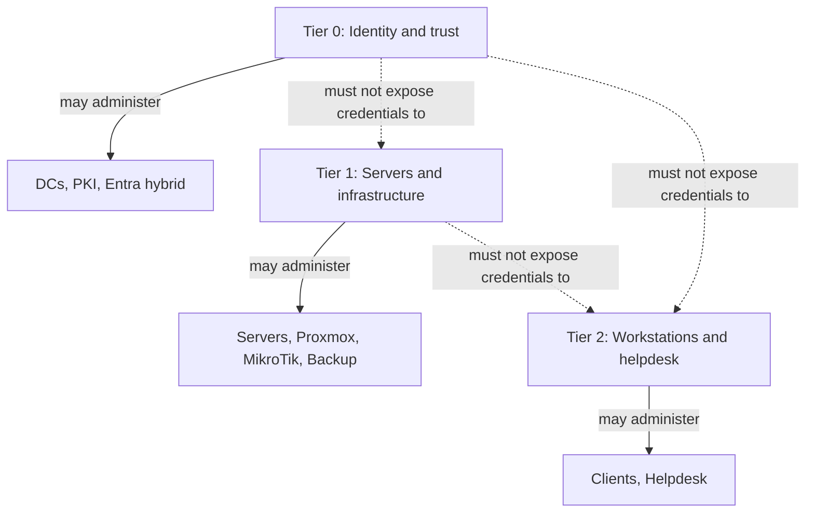

# Enterprise Administrative Tiering

## Document Control

| Field | Value |
|---|---|
| Document ID | GEIL-SEC-TIER-001 |
| Owner | Infrastructure Engineering |
| Status | Draft |
| Version | 1.0 |
| Last Reviewed | 2026-06-30 |
| Review Cycle | Quarterly |
| Classification | Internal Confidential |

!!! note "Canonical GNTECH values"

    Forest: `corp.gntech.me`; NetBIOS: `GNTECH`; primary UPN suffix: `gntech.me`; Microsoft 365 primary domain: `gntech.me`; hybrid identity plane: Microsoft Entra ID; primary firewall: MikroTik CHR `HQ-FW01`.


## Purpose

Define the GEIL administrative tiering model used to protect Active Directory, PKI, Entra hybrid identity, servers, workstations, firewalls, hypervisors, and helpdesk operations.

## Architecture Overview



## Tier definitions

| Tier | Scope | Examples | Credential rule |
|---:|---|---|---|
| 0 | Identity and trust | Domain Controllers, PKI, Enterprise Admins, Domain Admins, Entra Connect | Use only from Tier 0 PAW/jump path. |
| 1 | Servers and infrastructure | Member servers, Proxmox, MikroTik CHR, backup, monitoring | Never administer Tier 0. |
| 2 | Workstations and helpdesk | Windows 11 clients, user support, endpoint helpdesk | Never administer servers or identity. |

## Privileged Access Workstations and jump hosts

Tier 0 work must originate from a dedicated Tier 0 PAW or approved jump host with no email, browsing, productivity apps, or lower-tier administration. Tier 1 and Tier 2 may use separate PAWs or jump hosts scoped to their tier.

## Allowed and forbidden logons

| Account type | Allowed logon | Forbidden logon |
|---|---|---|
| Tier 0 admin | DCs, PKI, Tier 0 PAW/jump | Member servers, workstations, internet browsing hosts. |
| Tier 1 admin | Member servers, infrastructure consoles | Domain controllers, PKI private key systems. |
| Tier 2 admin | Workstations and support tools | Servers, domain controllers, PKI, backup control plane. |
| Daily user | Productivity systems only | Administrative consoles. |
| Service account | Service runtime only | Interactive logon unless documented exception. |

## Implementation examples

Validate tier group existence:

```powershell
Get-ADGroup -Identity "GG-T0-Domain-Admins"
Get-ADGroup -Identity "GG-T1-Server-Admins"
Get-ADGroup -Identity "GG-T2-Workstation-Admins"
```

Create a Tier 0 admin user only after the organizational foundation exists:

```powershell
Import-Module ActiveDirectory
$DomainDN = (Get-ADDomain).DistinguishedName
$Tier0OU = "OU=Tier 0,OU=Admin,OU=GNTECH,$DomainDN"
$Password = Read-Host "Enter temporary password" -AsSecureString

$ParentOU = $Tier0OU -replace '^OU=[^,]+,',''
$Tier0OUObject = Get-ADOrganizationalUnit `
    -LDAPFilter '(ou=Tier 0)' `
    -SearchBase $ParentOU `
    -SearchScope OneLevel `
    -ErrorAction Stop
if (-not $Tier0OUObject) {
    throw "Required OU missing: $Tier0OU. Complete the Organizational Foundation guide first."
}

$ExistingAdmin = Get-ADUser -LDAPFilter '(sAMAccountName=admin.gnolasco)' -ErrorAction Stop
if ($ExistingAdmin) {
    [PSCustomObject]@{Status="Exists"; Sam="admin.gnolasco"; DN=$ExistingAdmin.DistinguishedName}
}
else {
    $NewAdmin = New-ADUser -Name "Admin GNolasco" -SamAccountName "admin.gnolasco" -UserPrincipalName "admin.gnolasco@gntech.me" `
        -Path $Tier0OU `
        -AccountPassword $Password -Enabled $true -ChangePasswordAtLogon $true -PassThru
    [PSCustomObject]@{Status="Created"; Sam="admin.gnolasco"; DN=$NewAdmin.DistinguishedName}
}
```

## Validation

```powershell
Get-ADUser -SearchBase "OU=Admin,OU=GNTECH,$((Get-ADDomain).DistinguishedName)" -Filter * `
    -Properties UserPrincipalName,Enabled,DistinguishedName |
    Select-Object SamAccountName,UserPrincipalName,Enabled,DistinguishedName
Get-ADGroupMember "GG-T0-Domain-Admins" | Select-Object Name,SamAccountName,ObjectClass
```

Expected result: Tier 0 users are separate from daily users, use `@gntech.me`, and only approved accounts appear in Tier 0 groups.

## Stop conditions

STOP if a daily user is placed in Domain Admins, if Tier 0 credentials are used on a workstation, or if service accounts are assigned interactive privileged rights.

## Rollback

Remove incorrect membership first, then disable compromised accounts and reset credentials:

```powershell
Remove-ADGroupMember -Identity "GG-T0-Domain-Admins" -Members "admin.gnolasco" -Confirm:$true
Disable-ADAccount -Identity "admin.gnolasco"
```

## Evidence Collection

Capture tier group membership, admin OU user list, GPO logon-right assignments, and PAW/jump-host approval evidence. Do not capture passwords.

## Troubleshooting

| Symptom | Cause | Fix |
|---|---|---|
| Admin cannot manage expected system | Account in wrong tier group | Add to correct group after approval. |
| Tier 0 account used on workstation | Credential exposure | Disable account, reset password, investigate. |
| Service account used interactively | Misconfigured service or operator shortcut | Disable logon rights and rotate credentials. |

## Next Guide

Continue to [Group Policy Baseline](../microsoft-core/group-policy-baseline.md) to enforce tier logon controls.
