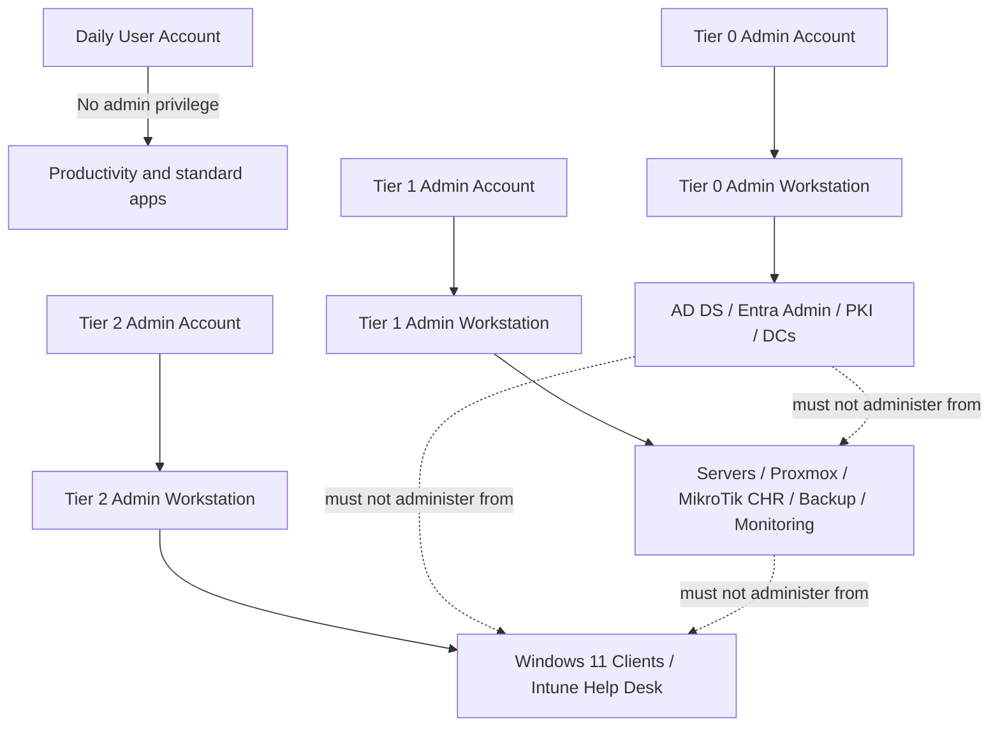
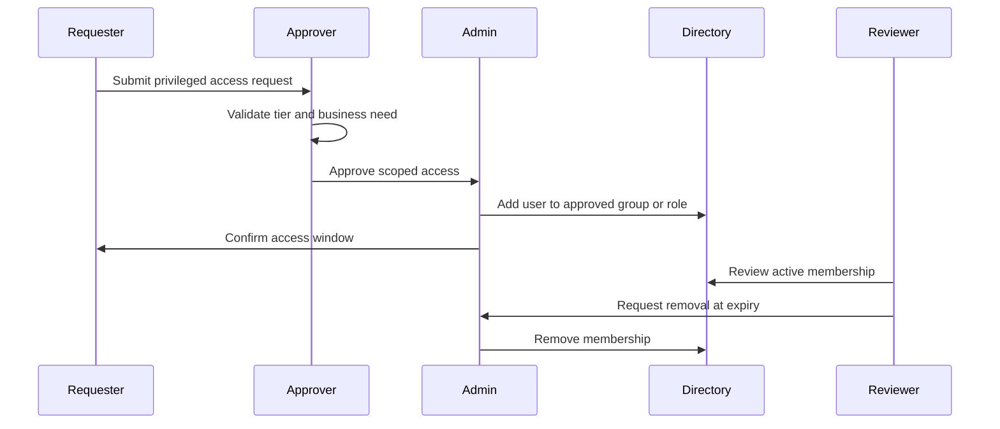
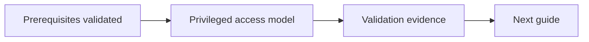

# Privileged Access Model

## Document Control

| Field | Value |
|---|---|
| Document ID | GEIL-SEC-PAM-001 |
| Owner | Infrastructure Engineering |
| Status | Draft |
| Version | 1.1 |
| Last Reviewed | 2026-06-29 |
| Review Cycle | Quarterly |
| Classification | Internal Confidential |

!!! note "Adaptation"

    This document uses canonical GNTECH values from the [Environment Specification](../project/environment-specification.md). Organizations adapting this design should change the environment specification first, then update all affected DNS zones, certificates, PowerShell commands, Group Policies, VLANs, firewall rules, and service configurations.

## Purpose

This document defines the GEIL privileged access model for Microsoft-centered enterprise infrastructure. It establishes tier separation, administrative accounts, privileged groups, administrative workstations, sign-in controls, emergency access, validation, monitoring, and rollback procedures.

The model is designed to protect the highest-impact systems first: Active Directory Domain Services, Microsoft Entra ID, PKI, identity synchronization, domain controllers, security tooling, endpoint management, virtualization, network edge, and backup infrastructure.

## Related foundation

This document is implemented with [Enterprise Administrative Tiering](administrative-tiering.md), [Enterprise Group Strategy](../microsoft-core/group-strategy.md), and [Enterprise Service Account Standard](../microsoft-core/service-account-standard.md).

## Scope

In scope:

- Active Directory administrative tiers.
- Microsoft Entra ID privileged roles and emergency access accounts.
- Administrative account naming and lifecycle.
- Privileged group design.
- Administrative workstation requirements.
- Sign-in restrictions and authentication controls.
- PowerShell implementation examples.
- Validation and rollback.
- Monitoring and recurring access review.

Out of scope:

- A full Privileged Identity Management deployment runbook.
- A complete Conditional Access policy baseline.
- A complete Privileged Access Workstation image build procedure.
- Third-party PAM vault implementation.

Those out-of-scope items are required follow-up documents and are identified later in this document.

## Design principles

| Principle | Requirement |
|---|---|
| Least privilege | Grant only the role required for the work and remove it when no longer needed |
| Tier isolation | Credentials from a higher tier must never be exposed to a lower tier system |
| Named accountability | Shared administrator accounts are prohibited except documented emergency access accounts |
| Separate daily and admin identities | Daily productivity accounts must not hold administrative roles |
| Strong authentication | Privileged cloud sign-in requires phishing-resistant or MFA-backed authentication |
| Controlled endpoints | Privileged work must originate from approved administrative workstations |
| Auditability | Privileged group membership and role assignment changes must be logged and reviewed |
| Recoverability | Emergency access exists for identity-provider or Conditional Access failures |

## Privileged access architecture



## Administrative tiers

### Tier 0: identity and trust plane

Tier 0 controls the enterprise identity system and all systems that can directly or indirectly compromise it.

Tier 0 includes:

- Active Directory forest, domains, domain controllers, FSMO roles, and AD-integrated DNS.
- Enterprise Admins, Domain Admins, Schema Admins, Administrators, Account Operators, Backup Operators, Server Operators, and equivalent delegated rights.
- AD CS root and issuing certificate authorities.
- Microsoft Entra ID Global Administrator, Privileged Role Administrator, Conditional Access Administrator, Hybrid Identity Administrator, and equivalent roles.
- Entra Connect Sync or Cloud Sync servers and service accounts.
- Domain controller backup and recovery credentials.
- Golden images or automation that can write to domain controllers or identity systems.

Tier 0 requirements:

- Use dedicated Tier 0 accounts only.
- Sign in only from Tier 0 administrative workstations.
- No email, web browsing, Teams, Office productivity, or general internet use.
- No local administrator reuse across lower tiers.
- Privileged membership must be reviewed weekly.

### Tier 1: server and infrastructure plane

Tier 1 controls enterprise servers and infrastructure that do not control identity authority but can materially affect business operations.

Tier 1 includes:

- Member servers.
- Proxmox VE hosts and clusters.
- MikroTik CHR firewall administration, unless firewall identity integration can compromise Tier 0.
- Backup infrastructure.
- Monitoring infrastructure.
- Windows Admin Center gateway.
- File, print, application, and management servers.

Tier 1 requirements:

- Use dedicated Tier 1 accounts only.
- Sign in only from Tier 1 administrative workstations.
- No Domain Admin or Enterprise Admin membership.
- Server local administrator rights must be granted through controlled groups.
- Tier 1 accounts must not administer domain controllers or PKI.

### Tier 2: endpoint and user support plane

Tier 2 controls workstations, user support, and endpoint management functions that do not administer servers or identity authority.

Tier 2 includes:

- Windows 11 Enterprise workstation support.
- Intune help desk functions.
- Local workstation administrator assignments.
- User support tooling.
- Device wipe, retire, and remote assistance where permitted.

Tier 2 requirements:

- Use dedicated Tier 2 accounts only.
- No server administrator rights.
- No domain controller sign-in rights.
- No privileged Entra roles beyond help desk roles approved for Tier 2.
- Must be constrained by Intune role-based access control where possible.

## Account naming standard

| Account Type | Format | Example | Notes |
|---|---|---|---|
| Daily user | `<first_initial>.<last_name>` | `j.smith` | No standing administrative roles |
| Tier 0 admin | `adm0.<username>` | `adm0.j.smith` | AD DS, PKI, Entra high privilege |
| Tier 1 admin | `adm1.<username>` | `adm1.j.smith` | Servers and infrastructure |
| Tier 2 admin | `adm2.<username>` | `adm2.j.smith` | Workstations and endpoint support |
| Emergency cloud access | `ea.<purpose>.<nn>` | `ea.globaladmin.01` | Cloud-only, excluded from normal dependency chain |
| Service account | `svc.<service>.<scope>` | `svc.aadconnect.sync` | Not interactive unless explicitly approved |
| Group managed service account | `gmsa-<service>` | `gmsa-wac` | Preferred for supported Windows services |

## Baseline OU structure

The authoritative OU implementation is defined in [Active Directory Organizational Foundation](../microsoft-core/active-directory-organizational-foundation.md). Privileged access uses the `Admin` branch of the canonical tree and must not create a parallel OU model.

```text
corp.gntech.me
└── GNTECH
    ├── Admin
    │   ├── Tier 0
    │   ├── Tier 1
    │   └── Tier 2
    ├── Users
    ├── Groups
    ├── Computers
    ├── Service Accounts
    └── Policies
```

Tier 0 identities belong under `OU=Tier 0,OU=Admin,OU=GNTECH,DC=corp,DC=gntech,DC=me`. Tier 1 and Tier 2 identities follow the equivalent tier OUs. Daily users do not belong in the `Admin` branch.

## Baseline privileged groups

| Group | Scope | Tier | Purpose |
|---|---|---:|---|
| `GG-T0-Domain-Admins` | Global | 0 | Controlled source group for AD DS Tier 0 administrators, created by the organizational foundation guide |
| `GG-T0-PKI-Admins` | Global | 0 | AD CS administrators and certificate managers |
| `GG-T0-Entra-Admins` | Global or cloud group | 0 | Cloud identity administrators |
| `GG-T0-DC-Logon-Allow` | Global | 0 | Accounts permitted to sign in to domain controllers |
| `GG-T1-Server-Admins` | Global | 1 | Server administrators |
| `GG-T1-Proxmox-Admins` | Global | 1 | Proxmox administrators if integrated with directory identity |
| `GG-T1-Firewall-Admins` | Global | 1 | MikroTik CHR administrators if integrated with directory identity |
| `GG-T1-Backup-Operators` | Global | 1 | Backup operators with scoped permissions |
| `GG-T2-Workstation-Admins` | Global | 2 | Workstation support administrators |
| `GG-T2-Intune-Helpdesk` | Cloud group | 2 | Intune help desk assignments |
| `GG-Privileged-Access-Review` | Global or cloud group | 0 | Reviewers for privileged access changes |

Do not add user accounts directly to high-privilege built-in groups except where Microsoft product behavior requires it. Use controlled groups and documented membership review.

## Implementation procedure: Active Directory OU and group baseline

### Explanation

The authoritative OU, user, group, delegation, and service account implementation now lives in [Active Directory Organizational Foundation](../microsoft-core/active-directory-organizational-foundation.md). This privileged access model consumes that structure instead of creating a parallel privileged OU tree.

### Required baseline

Before creating privileged accounts or assigning privileged group membership, validate that the organizational foundation created:

- `OU=GNTECH,DC=corp,DC=gntech,DC=me`.
- `OU=Admin,OU=GNTECH,DC=corp,DC=gntech,DC=me`.
- `OU=Tier 0,OU=Admin,OU=GNTECH,DC=corp,DC=gntech,DC=me`.
- `OU=Tier 1,OU=Admin,OU=GNTECH,DC=corp,DC=gntech,DC=me`.
- `OU=Tier 2,OU=Admin,OU=GNTECH,DC=corp,DC=gntech,DC=me`.
- `OU=Security,OU=Groups,OU=GNTECH,DC=corp,DC=gntech,DC=me`.
- Baseline groups such as `GG-T0-Domain-Admins`, `GG-T1-Server-Admins`, and `GG-T2-Workstation-Admins`.

### PowerShell validation

Run on: `HQ-MGMT01 unless this is an initial bootstrap step that explicitly requires HQ-DC01`

When: execute at this point in the procedure after the stated prerequisites are true and before continuing to the next step.

Expected outcome: the command completes successfully and the following expected result or validation section confirms the change.

```powershell
Import-Module ActiveDirectory -ErrorAction Stop
$DomainDN = (Get-ADDomain).DistinguishedName
$RequiredPaths = @(
    "OU=Admin,OU=GNTECH,$DomainDN",
    "OU=Tier 0,OU=Admin,OU=GNTECH,$DomainDN",
    "OU=Tier 1,OU=Admin,OU=GNTECH,$DomainDN",
    "OU=Tier 2,OU=Admin,OU=GNTECH,$DomainDN",
    "OU=Security,OU=Groups,OU=GNTECH,$DomainDN"
)
foreach ($Path in $RequiredPaths) {
    $Object = Get-ADObject -Identity $Path -ErrorAction SilentlyContinue
    if (-not $Object) {
        throw "Required OU missing: $Path"
    }
    $Object | Select-Object Name,DistinguishedName
}

$ExpectedGroups = @(
    "GG-T0-Domain-Admins",
    "GG-T1-Server-Admins",
    "GG-T2-Workstation-Admins"
)
foreach ($GroupName in $ExpectedGroups) {
    $Group = Get-ADGroup -LDAPFilter "(sAMAccountName=$GroupName)" -SearchBase "OU=Security,OU=Groups,OU=GNTECH,$DomainDN" -ErrorAction SilentlyContinue
    if (-not $Group) {
        throw "Required privileged access group missing: $GroupName"
    }
    $Group | Select-Object Name,GroupScope,DistinguishedName
}
```

### Expected result

The command returns the canonical admin OUs and privileged groups under `OU=GNTECH`.

### Stop condition

STOP. Do not create privileged users, add group membership, or configure privileged GPOs until the Active Directory Organizational Foundation guide validates successfully.

### Rollback

No rollback is required for this read-only validation. Roll back OU or group mistakes in the organizational foundation guide, not here.

## Implementation procedure: create a Tier 0 administrative user

### Explanation — Explanation

This procedure creates a named Tier 0 administrative account and places it in the Tier 0 Users OU. It does not automatically grant Domain Admin membership. Membership assignment requires a separate approved change.

### PowerShell — PowerShell

Run on: `HQ-MGMT01 unless this is an initial bootstrap step that explicitly requires HQ-DC01`

When: execute at this point in the procedure after the stated prerequisites are true and before continuing to the next step.

Expected outcome: the command completes successfully and the following expected result or validation section confirms the change.

```powershell
Import-Module ActiveDirectory
$DomainDN = (Get-ADDomain).DistinguishedName

$CurrentIdentity = [Security.Principal.WindowsIdentity]::GetCurrent()
$CurrentGroups = foreach ($Sid in $CurrentIdentity.Groups) {
    try {
        $Sid.Translate([Security.Principal.NTAccount]).Value
    }
    catch {}
}

$AllowedGroupNames = @(
    "Domain Admins",
    "Enterprise Admins"
)

$CurrentGroupShortNames = $CurrentGroups | ForEach-Object {
    ($_ -split "\\")[-1]
}

if (-not ($CurrentGroupShortNames | Where-Object { $_ -in $AllowedGroupNames })) {
    throw "Current user '$($CurrentIdentity.Name)' lacks approved permissions. Required group short name: $($AllowedGroupNames -join ', ')."
}
$UserName = "adm0.j.smith"
$DisplayName = "J. Smith Tier 0 Admin"
$TargetOU = "OU=Tier 0,OU=Admin,OU=GNTECH,$DomainDN"
$InitialPassword = Read-Host "Enter initial password" -AsSecureString

$ParentOU = $TargetOU -replace '^OU=[^,]+,',''
$Tier0OUObject = Get-ADOrganizationalUnit `
    -LDAPFilter '(ou=Tier 0)' `
    -SearchBase $ParentOU `
    -SearchScope OneLevel `
    -ErrorAction Stop
if (-not $Tier0OUObject) {
    throw "Required OU missing: $TargetOU. Complete the Active Directory Organizational Foundation guide first."
}

$EscapedUserName = $UserName.Replace('\','\5c').Replace('*','\2a').Replace('(','\28').Replace(')','\29')
$ExistingUser = Get-ADUser -LDAPFilter "(sAMAccountName=$EscapedUserName)" -ErrorAction Stop
if ($ExistingUser) {
    [PSCustomObject]@{Status="Exists"; Sam=$UserName; DN=$ExistingUser.DistinguishedName}
}
else {
    $NewUser = New-ADUser `
        -Name $DisplayName `
        -SamAccountName $UserName `
        -UserPrincipalName "$UserName@gntech.me" `
        -Path $TargetOU `
        -AccountPassword $InitialPassword `
        -Enabled $true `
        -ChangePasswordAtLogon $true `
        -Description "Tier 0 administrative account for J. Smith; no daily productivity use" `
        -PassThru
    [PSCustomObject]@{Status="Created"; Sam=$UserName; DN=$NewUser.DistinguishedName}
}
```

### Expected result — Expected result

A dedicated Tier 0 administrative user is created, enabled, and required to change password at first sign-in.

### Validation — Validation

Run on: `HQ-MGMT01 unless this is an initial bootstrap step that explicitly requires HQ-DC01`

When: execute at this point in the procedure after the stated prerequisites are true and before continuing to the next step.

Expected outcome: the command completes successfully and the following expected result or validation section confirms the change.

```powershell
Get-ADUser "adm0.j.smith" -Properties Enabled,Description,DistinguishedName,LastLogonDate |
    Select-Object SamAccountName,UserPrincipalName,Enabled,Description,DistinguishedName,LastLogonDate
```

Expected result: account exists in `OU=Tier 0,OU=Admin,OU=GNTECH`, has a `gntech.me` UPN, and has no last logon until first controlled use.

### Rollback — Rollback

If the account was created incorrectly and has not been used:

Run on: `HQ-MGMT01 unless this is an initial bootstrap step that explicitly requires HQ-DC01`

When: execute at this point in the procedure after the stated prerequisites are true and before continuing to the next step.

Expected outcome: the command completes successfully and the following expected result or validation section confirms the change.

```powershell
Disable-ADAccount "adm0.j.smith"
Move-ADObject `
    -Identity (Get-ADUser "adm0.j.smith").DistinguishedName `
    -TargetPath "OU=Disabled,OU=Users,OU=GNTECH,DC=corp,DC=gntech,DC=me"
```

Do not delete privileged accounts immediately if they have been used. Disable, investigate audit logs, then remove after retention requirements are met.

## Implementation procedure: privileged group membership assignment

### Explanation — Implementation procedure: privileged group membership assignment 2

Privileged membership must be explicit, change-controlled, idempotent, and validated. The organizational foundation guide assigns the pilot baseline `admin.gnolasco -> GG-T0-Domain-Admins`. For pilot/bootstrap only, the GEIL-controlled group may be nested into the built-in `Domain Admins` group. Do not add `admin.gnolasco` directly to `Domain Admins`.

### PowerShell — Implementation procedure: privileged group membership assignment 2

Run on: `HQ-MGMT01 unless this is an initial bootstrap step that explicitly requires HQ-DC01`

When: execute at this point in the procedure after the stated prerequisites are true and before continuing to the next step.

Expected outcome: the command completes successfully and the following expected result or validation section confirms the change.

```powershell
Import-Module ActiveDirectory

$Tier0Group = Get-ADGroup -Identity "GG-T0-Domain-Admins" -ErrorAction Stop
$BuiltInGroup = Get-ADGroup -Identity "Domain Admins" -Properties member -ErrorAction Stop

if ($BuiltInGroup.member -contains $Tier0Group.DistinguishedName) {
    [PSCustomObject]@{Status="Exists"; Member="GG-T0-Domain-Admins"; TargetGroup="Domain Admins"}
}
else {
    Add-ADGroupMember -Identity $BuiltInGroup.DistinguishedName -Members $Tier0Group.DistinguishedName
    [PSCustomObject]@{Status="Created"; Member="GG-T0-Domain-Admins"; TargetGroup="Domain Admins"}
}
```

### Expected result — Implementation procedure: privileged group membership assignment 2

Tier 0 rights are granted through the controlled GEIL group, not through direct user membership in `Domain Admins`.

### Validation — Implementation procedure: privileged group membership assignment 2

Run on: `HQ-MGMT01 unless this is an initial bootstrap step that explicitly requires HQ-DC01`

When: execute at this point in the procedure after the stated prerequisites are true and before continuing to the next step.

Expected outcome: the command completes successfully and the following expected result or validation section confirms the change.

```powershell
Get-ADGroupMember "GG-T0-Domain-Admins" | Select-Object Name,SamAccountName,ObjectClass
Get-ADGroupMember "Domain Admins" |
    Where-Object { $_.SamAccountName -eq "GG-T0-Domain-Admins" } |
    Select-Object Name,SamAccountName,ObjectClass
```

Expected result: the user is a member of `GG-T0-Domain-Admins`; `GG-T0-Domain-Admins` is the member visible in `Domain Admins`. Long-term GEIL should replace permanent built-in group nesting with PAW, approval workflow, JIT/JEA, and time-bound privileged access.

### Rollback — Implementation procedure: privileged group membership assignment 2

Run on: `HQ-MGMT01 unless this is an initial bootstrap step that explicitly requires HQ-DC01`

When: execute at this point in the procedure after the stated prerequisites are true and before continuing to the next step.

Expected outcome: the command completes successfully and the following expected result or validation section confirms the change.

```powershell
Remove-ADGroupMember -Identity "GG-T0-Domain-Admins" -Members "adm0.j.smith" -Confirm:$true
```

If the controlled group was incorrectly nested in a built-in group:

Run on: `HQ-MGMT01 unless this is an initial bootstrap step that explicitly requires HQ-DC01`

When: execute at this point in the procedure after the stated prerequisites are true and before continuing to the next step.

Expected outcome: the command completes successfully and the following expected result or validation section confirms the change.

```powershell
Remove-ADGroupMember -Identity "Domain Admins" -Members "GG-T0-Domain-Admins" -Confirm:$true
```

After rollback, revoke active sessions where applicable and review security logs for actions performed during the membership window.

## Sign-in controls

### Domain controller sign-in restrictions

Only approved Tier 0 accounts may sign in to domain controllers. Tier 1, Tier 2, service accounts, and daily accounts must be denied interactive sign-in.

Recommended GPOs:

| GPO | Link | Purpose |
|---|---|---|
| `GEIL-DC-Tier0-Logon-Control` | Domain Controllers OU | Permit only approved Tier 0 DC logon paths |
| `GEIL-Deny-Lower-Tier-On-DCs` | Domain Controllers OU | Deny Tier 1, Tier 2, service, and standard user interactive logon |
| `GEIL-Admin-Account-Audit` | Admin OU | Enable enhanced audit policy and PowerShell logging |

Policy settings to configure:

| User Right | Required Configuration |
|---|---|
| Allow log on locally | Approved DC administrators only |
| Allow log on through Remote Desktop Services | Approved DC administrators only; prefer no RDP except emergency or documented operations |
| Deny log on locally | Tier 1 admins, Tier 2 admins, service accounts, standard users |
| Deny log on through Remote Desktop Services | Tier 1 admins, Tier 2 admins, service accounts, standard users |
| Deny access to this computer from the network | Lower-tier admins where operationally feasible and tested |

### Server sign-in restrictions

Tier 0 accounts must not sign in to Tier 1 servers except for a documented emergency recovery procedure. If a Tier 0 credential is used on a lower-tier system, treat the credential as potentially exposed and rotate it.

### Workstation sign-in restrictions

Tier 0 and Tier 1 accounts must not sign in to standard user workstations. Use dedicated administrative workstations.

## Administrative workstation model

| Workstation Type | Used By | Permitted Targets | Requirements |
|---|---|---|---|
| Tier 0 PAW | Tier 0 admins | AD DS, DCs, PKI, Entra high-privilege portals | Hardened, restricted internet, no email, no productivity apps |
| Tier 1 admin workstation | Tier 1 admins | Servers, Proxmox, MikroTik CHR, backup, monitoring | Hardened, management network access, no Tier 0 use |
| Tier 2 admin workstation | Help desk and endpoint admins | Windows 11 clients, Intune help desk portals | Hardened support tools, no Tier 0 or Tier 1 use |

Minimum controls:

- Windows 11 Enterprise.
- BitLocker enabled.
- Secure Boot and TPM enabled.
- Microsoft Defender enabled and reporting.
- Local admin rights restricted.
- Browser access restricted by tier.
- Administrative tools installed only as needed.
- No personal browsing or email for Tier 0.

Validation from an administrative workstation:

Run on: `HQ-MGMT01 unless this is an initial bootstrap step that explicitly requires HQ-DC01`

When: execute at this point in the procedure after the stated prerequisites are true and before continuing to the next step.

Expected outcome: the command completes successfully and the following expected result or validation section confirms the change.

```powershell
dsregcmd /status
Get-BitLockerVolume
Get-MpComputerStatus | Select-Object AMServiceEnabled,AntivirusEnabled,RealTimeProtectionEnabled,IsTamperProtected
whoami /groups
```

Expected result: device state matches the approved join model, BitLocker is protected, Defender is healthy, and the signed-in account has only the expected tier permissions.

## Microsoft Entra ID privileged roles

Use separate cloud or synchronized privileged identities as approved by the identity architecture. Emergency access accounts must be cloud-only.

Baseline role mapping:

| Entra Role | Tier | Assignment Model | Notes |
|---|---:|---|---|
| Global Administrator | 0 | Eligible or emergency only where licensing supports it | Keep standing assignment minimal |
| Privileged Role Administrator | 0 | Eligible or tightly controlled permanent | Controls role assignments |
| Conditional Access Administrator | 0 | Eligible or controlled group | Can lock out tenant access |
| Hybrid Identity Administrator | 0 | Controlled assignment | Protects sync and federation settings |
| Security Administrator | 0 or 1 | Based on operating model | Coordinate with Defender operations |
| Intune Administrator | 1 or 2 | Scoped where possible | Avoid combining with Global Admin |
| Helpdesk Administrator | 2 | Scoped | User support only |

Required controls:

- At least two emergency access accounts are excluded from Conditional Access policies that could cause lockout.
- Emergency accounts use long unique credentials stored in an approved password manager.
- Emergency accounts are monitored and tested on a schedule.
- Normal privileged users must use MFA or phishing-resistant authentication.
- Privileged role assignments must be reviewed monthly.

Microsoft Graph validation example:

Run on: `HQ-MGMT01 unless this is an initial bootstrap step that explicitly requires HQ-DC01`

When: execute at this point in the procedure after the stated prerequisites are true and before continuing to the next step.

Expected outcome: the command completes successfully and the following expected result or validation section confirms the change.

```powershell
Connect-MgGraph -Scopes "RoleManagement.Read.Directory","User.Read.All"
Get-MgDirectoryRole | Select-Object DisplayName,Id
Get-MgUser -Filter "startswith(userPrincipalName,'ea.')" | Select-Object UserPrincipalName,AccountEnabled
```

Expected result: emergency access accounts exist, are enabled, and role inventory is visible for review.

## Emergency access model

Emergency access is required for identity outage, Conditional Access misconfiguration, MFA provider outage, federation failure, or administrator lockout.

Minimum requirements:

| Control | Requirement |
|---|---|
| Quantity | At least two emergency access accounts |
| Type | Cloud-only accounts for Microsoft Entra ID |
| Naming | `ea.globaladmin.01@gntech.me` and `ea.globaladmin.02@gntech.me` or approved equivalent |
| Storage | Credentials stored in approved break-glass vault process |
| Assignment | Global Administrator only where required for recovery |
| Conditional Access | Excluded from policies that can block all access, but monitored aggressively |
| Monitoring | Alert on every sign-in and failed sign-in |
| Testing | Quarterly controlled sign-in test |

Emergency access test procedure:

1. Open an approved change record.
2. Confirm two authorized witnesses or approvers are present according to internal policy.
3. Sign in with one emergency account from an approved admin workstation.
4. Confirm access to Entra admin center.
5. Confirm alert is generated.
6. Sign out and revoke session if required by policy.
7. Record evidence and rotate credential if the test procedure requires it.

## Service accounts and gMSA requirements

Service accounts are privileged when they can access infrastructure systems, read secrets, run scheduled tasks, or write to identity stores.

Requirements:

- Use group Managed Service Accounts where supported.
- Prohibit interactive sign-in for service accounts.
- Use long random passwords for traditional service accounts.
- Document owner, purpose, systems, permissions, rotation schedule, and recovery process.
- Do not place service accounts in Domain Admins.
- Monitor service account logon patterns.

Validation:

Run on: `HQ-MGMT01 unless this is an initial bootstrap step that explicitly requires HQ-DC01`

When: execute at this point in the procedure after the stated prerequisites are true and before continuing to the next step.

Expected outcome: the command completes successfully and the following expected result or validation section confirms the change.

```powershell
Get-ADUser -Filter 'SamAccountName -like "svc.*"' -Properties Description,Enabled,PasswordLastSet,LastLogonDate |
    Select-Object SamAccountName,Enabled,PasswordLastSet,LastLogonDate,Description

Get-ADServiceAccount -Filter * | Select-Object Name,Enabled,PrincipalsAllowedToRetrieveManagedPassword
```

Expected result: service accounts have owners in Description, are scoped to expected systems, and gMSAs are used where supported.

## Monitoring and alerting

Monitor these events and conditions:

| Event or Condition | Source | Severity |
|---|---|---|
| Member added to Domain Admins, Enterprise Admins, Schema Admins, or Administrators | Domain controller security log | Critical |
| Tier 0 account signs in to non-Tier 0 system | SIEM or endpoint logs | Critical |
| Emergency access account sign-in | Entra ID sign-in logs | Critical |
| Conditional Access policy changed | Entra ID audit logs | High |
| Entra privileged role assignment changed | Entra ID audit logs | High |
| New service account created | AD DS | Medium |
| Privileged account password reset | AD DS or Entra ID | High |
| Domain controller RDP sign-in | Domain controller security log | High |

PowerShell spot-check for privileged AD groups:

Run on: `HQ-MGMT01 unless this is an initial bootstrap step that explicitly requires HQ-DC01`

When: execute at this point in the procedure after the stated prerequisites are true and before continuing to the next step.

Expected outcome: the command completes successfully and the following expected result or validation section confirms the change.

```powershell
$PrivilegedGroups = "Domain Admins","Enterprise Admins","Schema Admins","Administrators","Account Operators","Server Operators","Backup Operators"
foreach ($Group in $PrivilegedGroups) {
    Get-ADGroupMember $Group | Select-Object @{Name="Group";Expression={$Group}},Name,SamAccountName,ObjectClass
}
```

Expected result: group membership matches the approved access register with no unknown users or nested groups.

## Recurring access review

| Review | Frequency | Owner | Evidence |
|---|---|---|---|
| Tier 0 AD group membership | Weekly | Infrastructure Engineering | Exported group membership attached to review record |
| Entra privileged roles | Weekly for Global Admin, monthly for others | Identity owner | Role assignment export |
| Emergency access account test | Quarterly | Identity owner and Security Reviewer | Test record and alert evidence |
| Service account inventory | Quarterly | Service owner | Account register update |
| Administrative workstation compliance | Monthly | Endpoint owner | Intune or Defender compliance report |

## Access request workflow

1. Requester opens a change or access request.
2. Request identifies tier, role, target system, duration, and business justification.
3. Owner approves or rejects.
4. Administrator grants access using the least-privileged group or role.
5. Administrator validates access and records evidence.
6. Access is removed at expiration or during review.
7. Reviewer confirms removal.



## Validation checklist

A GEIL environment satisfies the privileged access baseline only when:

- Dedicated admin OUs exist.
- Tier 0, Tier 1, and Tier 2 groups exist.
- Daily accounts have no standing administrative privilege.
- Tier 0 accounts are separate from Tier 1 and Tier 2 accounts.
- Domain Admins and Enterprise Admins contain only approved users or controlled groups.
- Emergency access accounts exist and are monitored.
- Tier 0 accounts are blocked from lower-tier interactive use by policy or monitored compensating control.
- Administrative workstations are defined and assigned by tier.
- Access review evidence exists.

Validation command set:

Run on: `HQ-MGMT01 unless this is an initial bootstrap step that explicitly requires HQ-DC01`

When: execute at this point in the procedure after the stated prerequisites are true and before continuing to the next step.

Expected outcome: the command completes successfully and the following expected result or validation section confirms the change.

```powershell
Get-ADGroupMember "Domain Admins"
Get-ADGroupMember "Enterprise Admins"
Get-ADGroupMember "Schema Admins"
Get-ADOrganizationalUnit -LDAPFilter "(ou=Admin)" -SearchBase (Get-ADDomain).DistinguishedName
Get-ADUser -Filter 'SamAccountName -like "adm*.*"' -SearchBase "OU=Admin,OU=GNTECH,$((Get-ADDomain).DistinguishedName)" -Properties Enabled,LastLogonDate |
    Select-Object SamAccountName,Enabled,LastLogonDate,DistinguishedName
```

Expected result: only approved administrative objects exist and privileged group membership matches the access register.

## Rollback and containment

Use rollback when privileged access was granted incorrectly or when a tier boundary was violated.

### Remove incorrect AD group membership

Run on: `HQ-MGMT01 unless this is an initial bootstrap step that explicitly requires HQ-DC01`

When: execute at this point in the procedure after the stated prerequisites are true and before continuing to the next step.

Expected outcome: the command completes successfully and the following expected result or validation section confirms the change.

```powershell
Remove-ADGroupMember -Identity "GG-T0-Domain-Admins" -Members "adm0.j.smith" -Confirm:$true
```

Validation:

Run on: `HQ-MGMT01 unless this is an initial bootstrap step that explicitly requires HQ-DC01`

When: execute at this point in the procedure after the stated prerequisites are true and before continuing to the next step.

Expected outcome: the command completes successfully and the following expected result or validation section confirms the change.

```powershell
Get-ADGroupMember "GG-T0-Domain-Admins" | Where-Object {$_.SamAccountName -eq "adm0.j.smith"}
```

Expected result: no object is returned.

### Disable a suspected compromised privileged account

Run on: `HQ-MGMT01 unless this is an initial bootstrap step that explicitly requires HQ-DC01`

When: execute at this point in the procedure after the stated prerequisites are true and before continuing to the next step.

Expected outcome: the command completes successfully and the following expected result or validation section confirms the change.

```powershell
Disable-ADAccount "adm0.j.smith"
Set-ADAccountPassword "adm0.j.smith" -Reset -NewPassword (Read-Host "New random password" -AsSecureString)
```

Expected result: account is disabled and password is reset to prevent continued use.

### Containment after tier violation

If a Tier 0 credential is used on a Tier 1 or Tier 2 asset:

1. Disable or isolate the lower-tier asset if compromise is suspected.
2. Reset the Tier 0 account password from a clean Tier 0 workstation.
3. Review domain controller logs for the exposure window.
4. Review endpoint logs on the lower-tier asset.
5. Rotate related secrets if credential theft cannot be excluded.
6. Record incident evidence and lessons learned.

## Security considerations

- Do not use Domain Admin accounts for routine server administration.
- Do not browse the internet or read email from Tier 0 workstations.
- Do not synchronize emergency access accounts from Active Directory.
- Do not exclude emergency access accounts from monitoring.
- Do not store privileged credentials in scripts, documentation, or source control.
- Do not grant permanent Global Administrator unless a documented operating model requires it and monitoring is in place.
- Treat backup administrators as high-impact privileged users because backups can be used to recover or expose identity systems.
- Treat PKI administrators as Tier 0 because they can issue authentication certificates.

## Required ADRs, runbooks, diagrams, and cross-references

### ADRs

No ADR is required for adopting this model because it follows the GEIL identity architecture and Microsoft-aligned tiering principles.

Create or recommend an ADR if any of the following deviations are proposed:

- A single shared administrator account is used outside emergency access.
- Daily productivity accounts receive standing administrative privilege.
- Tier 0 administration is performed from standard workstations.
- Emergency access accounts are not created.
- The organization chooses not to separate Tier 0, Tier 1, and Tier 2 administration.
- A third-party PAM product becomes the authoritative privileged access control plane.

### Required follow-up runbooks

- Privileged access request and approval runbook.
- Emergency access account test and recovery runbook.
- Privileged Access Workstation build runbook.
- Microsoft Entra PIM activation and review runbook, where licensing supports PIM.
- Service account lifecycle and gMSA runbook.

### Diagrams

Included:

- Privileged access tier architecture.
- Privileged access request workflow sequence.

Recommended future diagrams:

- Tier 0 administrative workstation network path.
- Entra privileged role assignment lifecycle.
- Service account ownership and rotation workflow.

### Cross-references

- [Identity Architecture](../architecture/identity-architecture.md)
- [Naming and Addressing Standard](../governance/naming-addressing-standard.md)
- [Active Directory Implementation](../microsoft-core/active-directory-implementation.md)
- [Group Policy Baseline](../microsoft-core/group-policy-baseline.md)
- [Microsoft 365 Tenant Foundation](../cloud-endpoint/microsoft-365-tenant-foundation.md)
- [Entra ID Hybrid Identity](../cloud-endpoint/entra-id-hybrid-identity.md)
- [Intune Windows 11 Enterprise](../cloud-endpoint/intune-windows11-enterprise.md)
- [Windows Hello for Business](../cloud-endpoint/windows-hello-for-business.md)
- [Microsoft Defender](../cloud-endpoint/microsoft-defender.md)
- [Security Operations](../operations/security-operations.md)
- [Monitoring and Alerting](../operations/monitoring-alerting.md)


## Audit Correction Notes

!!! success "Execution-order audit"

    This guide was audited for command order, object dependencies, canonical GEIL values, rollback coverage, validation gates, and active MikroTik CHR firewall references. Follow dependency order exactly: validate prerequisites, create objects, validate objects, apply dependent settings, then capture evidence.

- Audit focus: Establish administrative boundaries after identity and management foundations exist.
- Active Phase 1 firewall implementation: MikroTik CHR / RouterOS on `HQ-FW01`.
- OPNsense is superseded and must not be used for active Phase 1 deployment.

## Learning Objectives

After completing this guide you will understand:

- What the `Privileged access model` workstream changes.
- Why the sequence matters.
- Which validations prove the change worked.
- How to recover safely if a step fails.

## What You Will Build

By the end of this guide you will have:

- ✓ Completed the `Privileged access model` workstream.
- ✓ Captured validation evidence.
- ✓ Preserved rollback or recovery options.

## Estimated Time

30-90 minutes depending on prerequisite readiness and evidence capture.

## Difficulty

Intermediate. Follow the documented order and validate after each major stage.

## Risk Level

Medium. The risk is controlled by validating prerequisites, splitting commands into small blocks, and keeping rollback options available.

## Service Impact

Maintenance window recommended when the guide changes network, identity, firewall, or policy behavior. Read-only validation steps have no service impact.

## Prerequisites

- Canonical GEIL values reviewed in [Environment Specification](../project/environment-specification.md).
- Previous dependency completed where applicable.
- Administrative access and console recovery path available.
- Secrets stored in the approved password manager, not Git.

## Expected Starting State

- Required prerequisite guide is complete.
- No command in this guide references an object before it exists.
- Existing public/non-GEIL resources remain unchanged.

## Expected Ending State

- `Privileged access model` is complete and validated.
- Evidence is captured.
- Rollback or recovery path remains documented.

## Architecture Overview



## Background Knowledge

This guide follows the GEIL educational method: teach the purpose, validate prerequisites, apply changes in dependency order, validate immediately, and preserve recovery paths.

## Step-by-Step Procedure

Follow the procedure sections in this document in order. Do not skip validation gates or combine risky command blocks.

## Validation after each major stage

Validate immediately after each change block. Do not continue when expected output does not match the guide.

## Expected Results

- Commands complete without referencing missing objects.
- Canonical GEIL values are visible in outputs.
- No active OPNsense deployment path remains for Phase 1 firewall work.
- `10.10.x.x` remains limited to existing non-GEIL `PROD`/`TEST` references only.

## Evidence to capture

- Command output proving prerequisite state.
- Command output proving ending state.
- Relevant GUI screenshots where applicable.
- Rollback checkpoint or export evidence where applicable.

## Common Mistakes

| Mistake | Impact | Correction |
|---|---|---|
| Running steps out of order | Commands fail or partial state is created | Return to the last validation gate |
| Referencing missing objects | Invalid commands or unsafe defaults | Create and validate the object first |
| Skipping rollback capture | Recovery is slower | Capture snapshot/export before risky changes |

## Troubleshooting

Start with read-only validation. Confirm prerequisites, object existence, canonical values, and logs before changing configuration.

## Knowledge Check

1. What prerequisite must exist before this guide can run safely?
2. Which validation proves the main change worked?
3. What rollback action is safest if the last command fails?

## Next Guide

Continue to:

- [PowerShell Operations](../microsoft-core/powershell-operations.md)
